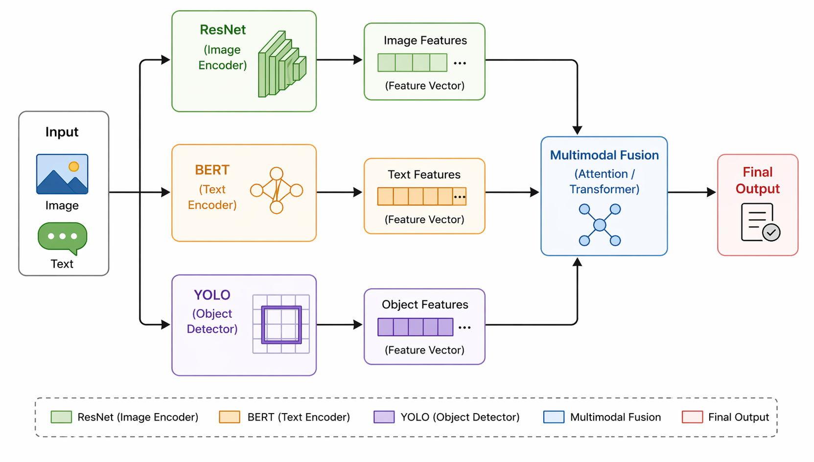
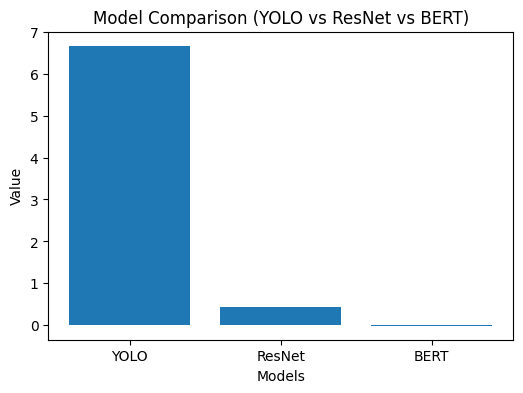
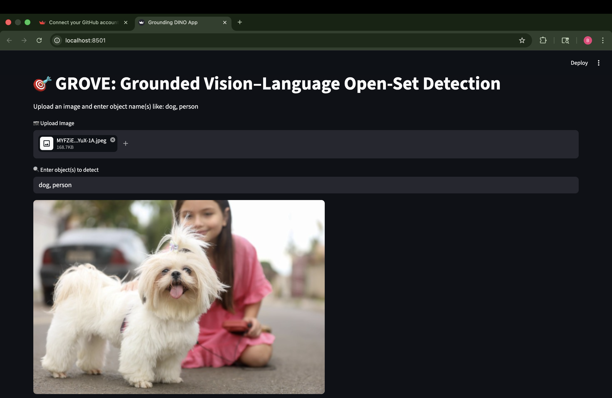
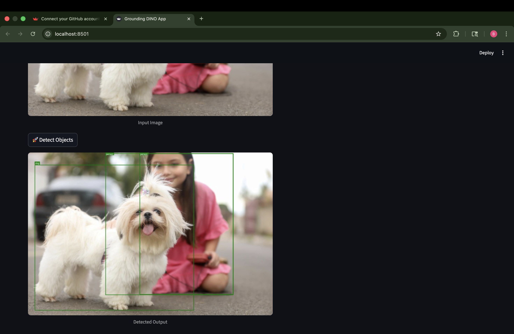

# 📌 GROVE--Grounded-Vision-Language-Open-Set-Detection
GROVE (Grounded Vision–Language Open-Set Detection) is a multimodal AI system that combines computer vision and natural language processing to enable object detection using text prompts. It integrates detection, visual feature extraction, and semantic understanding to move beyond traditional closed-set models and real-world applications.

## 🚀 Features
- Open-set object detection using text prompts  
- Multimodal learning (Vision + Language)  
- Real-time object detection  
- Streamlit-based interactive UI  

## 🧠 Motivation
Traditional object detection models like YOLO and Faster R-CNN detect only predefined classes. GROVE overcomes this limitation by integrating vision and language, enabling detection of unseen objects.

## 🏗️ System Architecture

## 🏗️ Methodology
The GROVE system follows a multimodal pipeline:

1. User uploads an image and provides a text prompt  
2. ResNet extracts visual features from the image  
3. BERT encodes the textual input into semantic embeddings  
4. YOLO performs object detection on the image  
5. Outputs from all models are combined  
6. Final output displays detected objects with contextual understanding  

## 🧩 Models Used
- **YOLO** → Object Detection (bounding boxes, object counts)  
- **ResNet** → Visual Feature Extraction  
- **BERT** → Text Understanding and Semantic Encoding

## 📦 Dataset

This project uses publicly available datasets for object detection and multimodal learning.

### 🔹 COCO Dataset 
- Used for object detection tasks
- Contains images with multiple object categories

👉 Download Link:  
https://cocodataset.org/#download  

👉 Direct Downloads:  
Train Images: http://images.cocodataset.org/zips/train2017.zip  
Validation Images: http://images.cocodataset.org/zips/val2017.zip 

## ⚙️ Tech Stack
- Python  
- Streamlit (Frontend)  
- PyTorch  
- Torchvision  
- OpenCV / PIL  
- NumPy

## 📊 Results

| Model  | Value | Description |
|--------|------|-------------|
| YOLO   | 6.7  | Average detected objects |
| ResNet | 0.45 | Visual feature representation |
| BERT   | 0.02 | Text embedding value |

## 🖼️ Sample Output
- Uploaded image is processed through the system  
- Detected objects are highlighted using bounding boxes  
- Labels and confidence scores are displayed  
- Output reflects both visual and contextual understanding

## ▶️ How to Run

### 1. Clone Repository
git clone 

cd GROVE

### 2. Create Virtual Environment
python3 -m venv .venv  
source .venv/bin/activate  

### 3. Install Requirements
pip install -r requirements.txt  

### 4. Run Application
python3 -m streamlit run app.py  

## 🎯 Applications
- Autonomous Vehicles  
- Surveillance Systems  
- Robotics  
- AI-based Assistants  

## 🔮 Future Scope
- Integration with Segment Anything Model (SAM)  
- Real-time deployment  
- Multilingual support  
- Edge device optimization  
